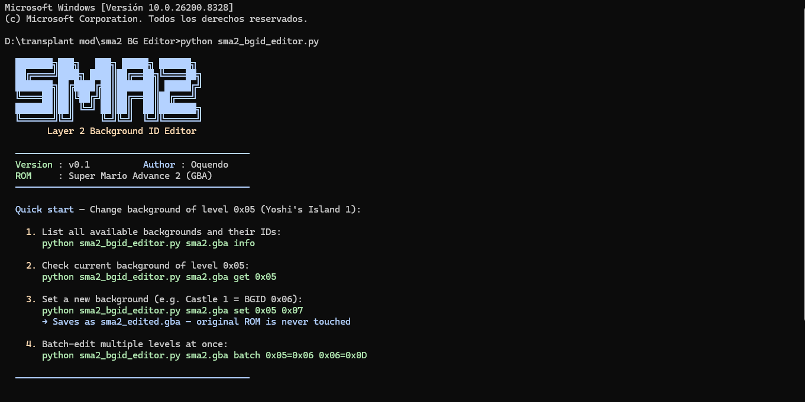
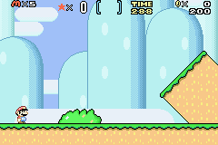
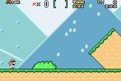

# SMA2 Layer 2 / BGID Editor by Oquendo

A command-line tool to edit Layer 2 background IDs, tilemap pointers, and visual header
fields in **Super Mario Advance 2: Super Mario World** (GBA, game code `AA2E`).

When you change a background, the tool automatically syncs the L2 tilemap pointer and
lets you interactively pick the background palette and back area color by name.
The foreground palette, sprite palette, and tileset are never touched arbitrarily —
see the [BG/FG risk section](#bgfg-coupling-and-risks) to understand why.

---

## Requirements

- Python 3.10+
- A valid SMA2 ROM (`AA2E` game code, any region)

> **Windows users only:** The tool forces UTF-8 output automatically to avoid `cp1252`
> encoding errors from the banner's box-drawing characters. No action needed.

---

## Usage



---

## Before / After





---

The original ROM is **never modified**. All output goes to `<rom>_edited.gba`.
If the file already ends in `_edited`, it is overwritten in place.

The banner (version info and quick-start guide) is only shown when you run the script
with no arguments. Running any command prints only that command's output.

---

## Commands

### `info`
Lists all 18 known backgrounds with their L2 tilemap offsets and the full header preset
the tool uses for each one (bg_pal, fg_pal, sp_pal, tileset, bg_color).

```
python sma2_bgid_editor.py sma2.gba info
```

> **No ROM needed for this command.** The table is built from internal data.

---

### `list`
Lists all named levels with their current BGID and L2 tilemap pointer.
Also flags mismatches between the BGID and the pointer (which can indicate corruption
or an intentional vanilla override).

```
python sma2_bgid_editor.py sma2.gba list
python sma2_bgid_editor.py sma2.gba list --raw   # dump all 521 sublevel slots
```

Without `--raw`, only named levels are shown (those with a known name in the level table).
With `--raw`, all 521 sublevel slots (0x000–0x208) are dumped, including unnamed internal
sublevels. Levels with BGID `0xFF` (interactive L2 object data) are marked with `o`.

---

### `get <level_id>`
Shows the BGID, L2 pointer, and sublevel/ROM offset info for a single level.
Reports `[vanilla override]` or `[MISMATCH]` if the pointer does not match the BGID.

```
python sma2_bgid_editor.py sma2.gba get 0x05
```

---

### `get-header <level_id>`
Shows the full 7-byte Layer 1 header for a level — every field, its current value,
and the raw bytes. Useful for debugging or manually verifying edits.

```
python sma2_bgid_editor.py sma2.gba get-header 0x05
```

Fields shown: `length`, `bg_pal`, `level_mode`, `scroll_a`, `sp_tileset`, `music`,
`fg_pal`, `sp_pal`, `timer`, `tileset`, `bg_color`, and the raw 7-byte hex dump with
its ROM offset.

---

### `set <level_id> <new_bgid>`
The main editing command. Does three things automatically:

1. Writes the new BGID to the BGID table
2. Updates the L2 tilemap pointer to match the new background
3. Patches the tileset ID in the header (auto, from a preset — see below)

Then interactively asks you two questions:

```
  Background palette:
    0 = green
    1 = blue
    2 = beige  <-- current
    3 = brown
    4 = strong purple (unused)
    5 = dark gray
    6 = dark brown
    7 = default green
  Pick Background palette (0-7) [Enter = keep 2]: _

  Back area color:
    0 = beige
    1 = light green
    2 = blue (default)
    3 = black
    4 = dark green
    5 = dark blue
    6 = light blue
    7 = white
  Pick Back area color (0-7) [Enter = keep 3]: _
```

Press **Enter** to keep the current value. The foreground palette and sprite palette
are never modified. If the level header cannot be read (invalid L1 pointer), the palette
prompts are skipped and only the BGID and pointer are written.

For **BGID `0xFF`** (interactive L2), the interactive prompts are skipped entirely —
only the BGID byte is updated (the L2 pointer is always left unchanged for `0xFF`).

```
python sma2_bgid_editor.py sma2.gba set 0x05 0x11
python sma2_bgid_editor.py sma2.gba set 0x05 0x11 --keep-ptr
```

---

### `batch <lvl=bgid> [lvl=bgid ...]`
Changes multiple levels in one pass. No interactive prompts — only BGID and L2 pointer
are updated. Use this when you know exactly what you want and need to apply many changes
at once. Header editing (bg_pal, bg_color) should be done per-level with `set` afterward.

Invalid pairs are skipped with a `SKIP` status; valid ones are applied and summarized.

```
python sma2_bgid_editor.py sma2.gba batch 0x05=0x11 0x06=0x0A 0x07=0x00
python sma2_bgid_editor.py sma2.gba batch 0x05=0x11 0x06=0x0A --keep-ptr
```

---

## Options

| Option | Effect |
|--------|--------|
| `--keep-ptr` | Skips updating the L2 tilemap pointer. Only the BGID byte is changed. Useful to replicate intentional vanilla overrides (see below). Works with both `set` and `batch`. |

---

## Level ID → Sublevel ID Mapping

The tool accepts user-facing level IDs and maps them to the real internal sublevel IDs
used in the ROM tables:

| Level ID range | Sublevel ID |
|----------------|-------------|
| `0x00` | `0x000` (Bonus game, special case) |
| `0x01` – `0x5A` | `level_id + 0x100` (overworld levels) |
| `0xB7` – `0xFF` | Same as level ID (bosses, special rooms) |
| `0x200` – `0x208` | Direct (Chocolate Island 2 extended rooms) |

Any value not in the above ranges is passed through as a direct sublevel ID.

---

## Known Level Names

The tool has names for the following level IDs. All others show as `Unknown`.

| Level ID | Name |
|----------|------|
| 0x00 | Bonus game (no-Yoshi intro slot) |
| 0x01 | #1 Iggy's Castle |
| 0x02 | Yoshi's Island 4 |
| 0x03 | Yoshi's Island 3 |
| 0x04 | Yoshi's House |
| 0x05 | Yoshi's Island 1 |
| 0x06 | Yoshi's Island 2 |
| 0x07 | Vanilla Ghost House |
| 0x08 | Intro Level |
| 0x09 | Vanilla Secret 1 |
| 0x0A | Vanilla Dome 3 |
| 0x0B | Donut Secret 2 |
| 0x0C–0x0D | Test Level / Front Door |
| 0x0E | Back Door |
| 0x0F | Valley of Bowser 4 |
| 0x10 | #7 Larry's Castle |
| 0x11 | Valley Fortress |
| 0x13–0x16 | Valley of Bowser 3–1 |
| 0x17 | Chocolate Secret |
| 0x18–0x1A | Vanilla Dome 2–1 |
| 0x1B | Red Switch Palace |
| 0x1C | #3 Lemmy's Castle |
| 0x1D–0x23 | Forest Ghost House / Forest of Illusion 1–4, Forest Secret Area |
| 0x24 | Chocolate Island 2 |
| 0x25–0x2B | Special World (Funky, Outrageous, Mondo, Groovy, Gnarly, Tubular) |
| 0x2C–0x2D | Way Cool / Awesome |
| 0x30–0x36 | Star World 1–5 |
| 0xB7–0xBF | Boss rooms (Wendy, Lemmy, Reznor, Iggy, Ludwig, Roy, Morton, Bowser) |
| 0xDF–0xFF | Bonus rooms, sublevels, exits, Valley Ghost House rooms |
| 0x200–0x208 | Chocolate Island 2 extended rooms (CI2 rooms 2–4) |

Duplicate entries (same level accessible via two IDs) are listed with `(dup)` in their name.

---

## ROM Tables and Addresses

These are the three ROM tables the tool reads and writes, all verified against the
SMA2 ROM map and spot-checked with real edits.

### BGID Table
```
ROM offset : 0x0F3B38 – 0x0F3D40
GBA address: 0x080F3B38
Size       : 0x209 entries, 1 byte each (521 sublevels, IDs 0x000–0x208)
Formula    : offset = 0x0F3B38 + sublevel_id
```

Each byte is the Background ID for that sublevel. The value `0xFF` is a special case
meaning the layer 2 is **interactive object data** rather than a static tilemap.

### L2 Tilemap Pointer Table
```
ROM offset : 0x0F2AF0 – 0x0F3313
GBA address: 0x080F2AF0
Size       : 0x209 entries, 4 bytes each (little-endian GBA pointers)
Formula    : offset = 0x0F2AF0 + sublevel_id * 4
```

Each 4-byte entry is a GBA pointer to either:
- A Layer 2 **16×16 tilemap** (when BGID ≠ 0xFF)
- Layer 2 **object data** (when BGID = 0xFF)

When you change a BGID, the tool also updates this pointer to match the canonical
tilemap address for the new background, unless `--keep-ptr` is used.

### L1 Data Pointer Table (header access)
```
ROM offset : 0x0F22CC – 0x0F2AEF
GBA address: 0x080F22CC
Size       : 0x209 entries, 4 bytes each (little-endian GBA pointers)
Formula    : offset = 0x0F22CC + sublevel_id * 4
```

Each pointer leads to the **Layer 1 object data**, which begins with a 7-byte header
containing most of the level's visual configuration. The tool reads and patches this
header when you use `set`.

### The 7-Byte Level Header

Located at the address pointed to by the L1 pointer table. Layout:

```
Byte 0:  bits 0–4  = length in screens (preserved)
         bits 5–7  = Background palette ID       ← tool writes this
Byte 1:  bits 0–4  = level mode (preserved)
         bits 5–7  = scroll-related (preserved)
Byte 2:  bits 0–3  = sprite tileset (preserved)
         bits 4–7  = music index (preserved)
Byte 3:  bits 0–2  = Foreground palette ID       ← never touched
         bits 3–5  = Sprite palette ID            ← never touched
         bits 6–7  = timer (preserved)
Byte 4:  bits 0–3  = Layer 1/2 tileset ID        ← tool writes this (auto from BGID)
         bits 4–7  = scroll/item memory (preserved)
Byte 5:  bits 0–3  = scroll-related (preserved)
         bits 4–7  = Back area color ID           ← tool writes this
Byte 6:  unused, always 0x00
```

Fields marked **preserved** are never changed regardless of what you do.
Fields marked **never touched** (fg_pal, sp_pal) are intentionally left alone —
see the risk section below.

---

## Background IDs and Their Tilemap Pointers

| BGID | ROM Offset | GBA Address | Description | Tileset (auto) |
|------|-----------|-------------|-------------|----------------|
| 0x00 | 0x0E42D0 | 0x080E42D0 | Yoshi's Island Mountains (default) | 0 |
| 0x01 | 0x0E4489 | 0x080E4489 | Aquatic | 9 |
| 0x02 | 0x0E4641 | 0x080E4641 | Athletic / Low Clouds with mountains | 0 |
| 0x03 | 0x0E4714 | 0x080E4714 | Athletic / High Clouds | 0 |
| 0x04 | 0x0E4824 | 0x080E4824 | Low Mountains | 0 |
| 0x05 | 0x0E4929 | 0x080E4929 | Chocolate Island Mountains | 0 |
| 0x06 | 0x0E4AD3 | 0x080E4AD3 | Castle 1 | 1 |
| 0x07 | 0x0E4E42 | 0x080E4E42 | High Mountains | 0 |
| 0x08 | 0x0E5044 | 0x080E5044 | Switch Palace | 4 |
| 0x09 | 0x0E5054 | 0x080E5054 | Night Stars | 6 |
| 0x0A | 0x0E5190 | 0x080E5190 | Beta Mountains? | 0 |
| 0x0B | 0x0E52BE | 0x080E52BE | Blank Background | 1 |
| 0x0C | 0x0E52CE | 0x080E52CE | Castle 2 | 1 |
| 0x0D | 0x0E564E | 0x080E564E | Underground | 3 |
| 0x0E | 0x0E59D2 | 0x080E59D2 | Forest of Illusion / Jungle | 0 |
| 0x0F | 0x0E5CD0 | 0x080E5CD0 | Ghost House | 5 |
| 0x10 | 0x0E5EC5 | 0x080E5EC5 | Sunken Ship | 5 |
| 0x11 | 0x0E61AA | 0x080E61AA | Castle 3 | 1 |
| 0xFF | — | — | Interactive L2 (object data) | — |

---

## Header Presets per BGID

When you use `set`, the tileset is automatically written from this table. The bg_pal
and bg_color are what the original game uses — they serve as the default suggestion
shown in the interactive prompts, but you can pick any value.

| BGID | Description | bg_pal | fg_pal | sp_pal | tileset | bg_color |
|------|-------------|--------|--------|--------|---------|----------|
| 0x00 | YI Mountains | 7 | 0 | 0 | 0 | 0 |
| 0x01 | Aquatic | 4 | 2 | 3 | 9 | 8 |
| 0x02 | Athletic / Low Clouds | 0 | 0 | 0 | 0 | 5 |
| 0x03 | Athletic / High Clouds | 0 | 6 | 0 | 0 | 6 |
| 0x04 | Low Mountains | 0 | 0 | 0 | 0 | 1 |
| 0x05 | Chocolate Island Mountains | 6 | 4 | 0 | 0 | 2 |
| 0x06 | Castle 1 | 3 | 3 | 1 | 1 | 3 |
| 0x07 | High Mountains | 0 | 0 | 0 | 0 | 1 |
| 0x08 | Switch Palace | 5 | 0 | 4 | 4 | 0 |
| 0x09 | Night Stars | 5 | 1 | 2 | 6 | 5 |
| 0x0A | Beta Mountains? | 3 | 7 | 0 | 0 | 0 |
| 0x0B | Blank Background | 5 | 4 | 2 | 1 | 3 |
| 0x0C | Castle 2 | 6 | 7 | 1 | 1 | 4 |
| 0x0D | Underground | 6 | 4 | 4 | 3 | 3 |
| 0x0E | Forest / Jungle | 7 | 0 | 0 | 0 | 0 |
| 0x0F | Ghost House | 5 | 4 | 5 | 5 | 3 |
| 0x10 | Sunken Ship | 6 | 4 | 5 | 5 | 3 |
| 0x11 | Castle 3 | 3 | 3 | 1 | 1 | 3 |

> `fg_pal` and `sp_pal` are shown for reference only — the tool never writes them.

---

## Palette and Color Reference

### Background Palette (BG palette, byte 0 bits 5–7)
Controls the color scheme of the Layer 2 background tiles.

| Value | Color |
|-------|-------|
| 0 | Green |
| 1 | Blue |
| 2 | Beige |
| 3 | Brown |
| 4 | Strong purple (unused) |
| 5 | Dark gray |
| 6 | Dark brown |
| 7 | Default green |

### Back Area Color (byte 5 bits 4–7)
Controls the solid backdrop color behind all layers — the "sky" or void color.

| Value | Color |
|-------|-------|
| 0 | Beige |
| 1 | Light green |
| 2 | Blue (default) |
| 3 | Black |
| 4 | Dark green |
| 5 | Dark blue |
| 6 | Light blue |
| 7 | White |

---

## BG/FG Coupling and Risks

This is the most important section if you are hacking levels.

### Why the tileset is auto-locked to the BGID

The **Layer 1/2 tileset ID** (byte 4 bits 0–3) is documented in the ROM map as a
single shared field that controls **both** layers simultaneously:

> `[03003F98]+6 (normally 8-bit) is treated as 16-bit, with both the high and low bytes set to this value`

It determines:
- Which **16×16 tile layout tables** are used (there are 5 groups, each at a different ROM address)
- Which **object function pointers** are used (different code runs for different tilesets when placing objects like pipes, blocks, platforms)
- Which **Layer 0 flag tables** are used (collision and rendering flags)

The ROM map confirms 5 distinct tileset groups, each sharing tile data and object behavior:

| Tileset group | Object function table |
|--------------|----------------------|
| 0, 7, C | 0x080DF220 |
| 1 | 0x080E246C |
| 2, 6, 8 | 0x080E2CD8 |
| 3, 9, A, B, E | 0x080E3674 |
| 4, 5, D | 0x080E4100 |

**If you change the tileset to one from a different group**, tile rendering breaks.
Objects that rely on tileset-specific functions (pipes, coin blocks, platforms, doors)
will render wrong, behave wrong, or crash. This is why the tool sets the tileset
automatically from the BGID and does not let you change it freely.

**Swapping within the same group is safe** — for example, tileset 2, 6, and 8 all use
the same object functions and tile tables, so you could theoretically use any of them
interchangeably without breaking the FG. However, the tool does not expose this because
it requires knowing which group you are in and why you need a different tileset within
that group, which is an advanced use case.

### Why fg_pal and sp_pal are never modified

The **foreground palette** (byte 3 bits 0–2) and **sprite palette** (byte 3 bits 3–5)
determine how the foreground tiles and sprites are colored. These are tied to the actual
graphics slot data loaded for Layer 1 — changing them without also swapping the GFX
files loaded into VRAM will produce wrong or corrupted colors on all FG tiles and sprites.

The background palette, by contrast, only affects Layer 2, which is a separate tilemap
with its own color slots. This is why the tool lets you pick it freely.

### Summary: what is safe to change

| Field | Safe to change freely? | Notes |
|-------|------------------------|-------|
| BGID | Yes | Tool handles the pointer sync |
| L2 tilemap pointer | Yes (via BGID) | Do not set manually unless you know the target |
| Background palette | Yes | Only affects Layer 2 colors |
| Back area color | Yes | Only affects the solid backdrop |
| Tileset | **No** | Crossing groups breaks FG tile rendering and object behavior |
| Foreground palette | **No** | Tied to loaded GFX data, changing it corrupts FG colors |
| Sprite palette | **No** | Same reason as FG palette |
| Music, timer, scroll | N/A | Preserved but not related to visuals |

---

## Intentional Vanilla Mismatches

Two sublevels in the original game have a BGID that does not match their L2 pointer.
These are intentional overrides — they use one background's graphics but a different
background's tilemap layout:

| Sublevel | BGID | Actual L2 pointer | Expected pointer | Notes |
|----------|------|-------------------|------------------|-------|
| 0x108 | 0x0A (Beta Mountains?) | 0x080E42D0 | 0x080E5190 | Story intro — Vanilla Dome gfx, Plains layout |
| 0x112 | 0x00 (YI Mountains) | 0x080E4929 | 0x080E42D0 | Plains gfx, Chocolate Island layout |

The tool detects these and reports them as `[vanilla override]` instead of `[MISMATCH]`.
If you run `set` on either of these sublevels without `--keep-ptr`, the mismatch will
be corrected and the pointer will be synced to the BGID. Use `--keep-ptr` to preserve
the original irregular pointer.

---

## ROM Validation

When loading a ROM, the tool checks the GBA header for:
- Game title containing `MARIO`
- Game code exactly `AA2E`

If validation fails, a warning is printed but the tool continues anyway. This allows
working with patched or modified ROMs that may have a different title string.

---

## Examples

```bash
# See all backgrounds and their full header presets (no ROM needed)
python sma2_bgid_editor.py sma2.gba info

# List all named levels with current BGID and pointer
python sma2_bgid_editor.py sma2.gba list

# Dump all 521 raw sublevel slots
python sma2_bgid_editor.py sma2.gba list --raw

# Inspect a single level's full 7-byte header
python sma2_bgid_editor.py sma2.gba get-header 0x05

# Quick BGID + pointer check for a level
python sma2_bgid_editor.py sma2.gba get 0x05

# Change Yoshi's Island 1 to Castle 3 background, then pick palette/color interactively
python sma2_bgid_editor.py sma2.gba set 0x05 0x11

# Same but preserve the existing L2 pointer (keep custom tilemap layout)
python sma2_bgid_editor.py sma2.gba set 0x05 0x11 --keep-ptr

# Bulk-change multiple levels at once (no prompts, only BGID + pointer updated)
python sma2_bgid_editor.py sma2.gba batch 0x05=0x11 0x06=0x0A 0x07=0x00
```